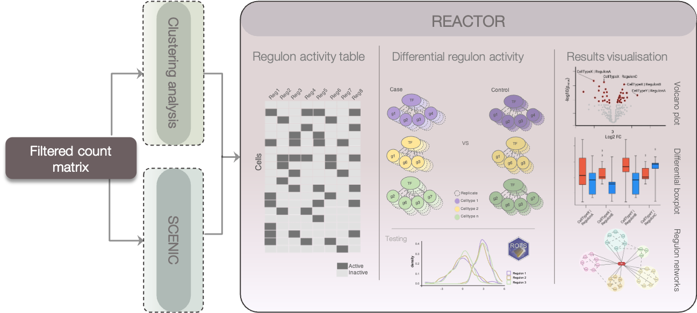

# REACTOR
This is an R package for statistical analysis of regulons. This package expects the outputs of the SCENIC framework and clustering information as its inputs. The package uses ROTS R package for conducting the statistical testing and this in turn makes it possible to conduct the analysis on data of various experimental conditions, including case-control- and multigroup analysis. REACTOR outputs the resulting ROTS object as well as a dataframe of the results for users with no experience using ROTS.

<div align="center">

<picture>
	<source srcset="man/figures/reactor_workflow_darkmode.png" media="(prefers-color-scheme: dark)"/>
	
</picture>

</div>


## :package: Installation
``` R 
install.packages("devtools")
devtools::install_github("elolab/REACTOR")

```

Or from source (in your shell)
```
git clone THISPAGE
R -e 'install.packages("devtools"); devtools::install("REACTOR")'
```


## :hammer_and_wrench: Usage

Please see the vignette for a more detailed example analysis and explanation of the parameters used!

Load the library
``` R 
library(REACTOR)

```
##### Data import
REACTOR requires the user to provide binarized activity matrix produced by SCENICs binarize()-function [1], clinical information (a table that matches the single cell samples to patients and conditions) and a clustering table.
``` R 
rbm <- read_csv(rbm_fname) # Reading in the binarized activtiy matrix
studyDesign <- read_csv(study_fname) # Reading in the clinical information
clustering <- read_csv(cluster_fname) # Reading in the clustering table
```
##### Processing the data into a format that can be analyzed

Now that we have some data to work with we can start running the REACTOR analysis. The first step in the REACTOR workflow is to create the activity matrix for the differential activity analysis. This can be done using the REACTOR processData-function. Lets look at the parameters:

|Parameter |Explanation |
|:-------- |:-------- |
|minCells |minimum number of cells present in a cell-type cluster within a donor |
|RBM |Regulon Binary Matrix. This is produced by SCENIC's binarize-function (1st column should represent the single cell sample IDs) |
|Study Design |Study design dataframe. Should contain information (as columns) from which sample and which condition the single cell sample came and the 1st column should represent the single cell sample IDs  |
|Clustering |Clustering dataframe (1st column should represent the single cell sample IDs) |
|cluster_cName |Column name of the clustering to use from the Clustering dataframe |
|condition_cName |Name of the column of conditions to be contrasted from the StudyDesign dataframe (i.e COVID or Healthy) |
|sample_cName |Name of the sample column from the StudyDesign dataframe |

``` R 
sample_cname      = "donor"
cluster_cname     = "cellTypeClusters"
condition_cname   = "status"

minCells = 0

# processData returns a list that contains the processed data at index 1 and
# RegulonActivity dataframe at index 2. The regulonActivity dataframe can be
# viewed to fine tune the minCells parameter for future runs.
data_out <- REACTOR::processData(minCells = minCells, RBM = rbm,
StudyDesign = studyDesign, Clustering = clustering,
condition_cName = condition_cname, sample_cName = sample_cname,
cluster_cName = cluster_cname)
```
##### Conducting the differential expression analysis
Now that we have done some data pre-processing we can run the differential activity analysis using the differentialActivityAnalysis-function. REACTOR uses ROTS [2] to conduct the analysis.
Again lets look at the parameters of the function first:

|Parameter |Explanation |
|:-------- |:-------- |
|data |Dataframe containing the proportional counts of binary regulon activity. This is the first output produced by the REACTOR::processData-function. |
|groups |Vector specifying the experimental groups (i.e. COVID, Healthy) as integers |
|maxZeros |Maximum number of zero values present in a row of the input data frame. Rows that contain more zero values than this parameter will be filtered before the ROTS analysis. |
|... |Parameters passed onto ROTS. See  [ROTS](https://www.bioconductor.org/packages/release/bioc/html/ROTS.html) |

``` R 
groups <- c(1,1,1,2,2,2) 

# Differential activity analysis using REACTOR
#The function returns a list whose outputs are as follows: at index 1 you have the ROTS object and at index 2 you have simplified results table 
DAA_out <- REACTOR::differentialActivityAnalysis(data_out[[1]], groups)
```


## :books: References
[1] B. Van de Sande et al., “A scalable SCENIC workflow for single-cell gene regulatory network analysis,” Nat. Protoc., vol. 15, no. 7, Art. no. 7, Jul. 2020, doi: 10.1038/s41596-020-0336-2.<br>
[2] T. Suomi, F. Seyednasrollah, M. K. Jaakkola, T. Faux, and L. L. Elo, “ROTS: An R package for reproducibility-optimized statistical testing,” PLOS Comput. Biol., vol. 13, no. 5, p. e1005562, May 2017, doi: 10.1371/journal.pcbi.1005562.