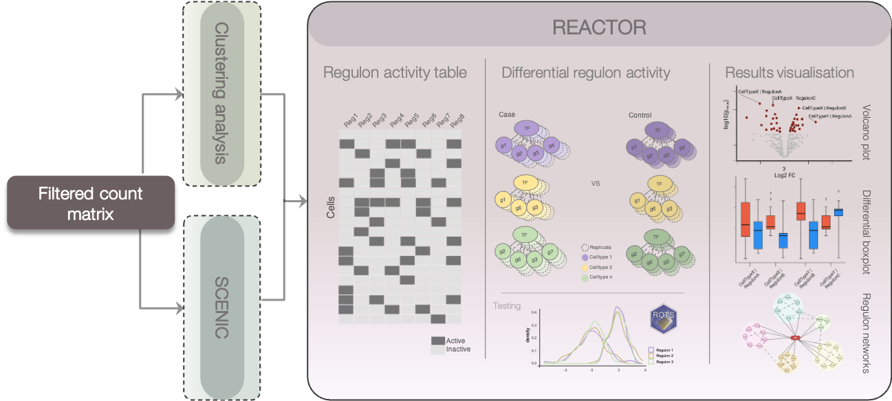

# REACTOR
This is an R package for statistical analysis of regulons (transcription factor with its predicted targets) described in paper ["REACTOR: REgulon Activity analysis and Comparison Tool for single-cell transcriptOmics Research"](https://doi.org/10.1093/bioinformatics/btag203). This package expects the outputs of the SCENIC framework and clustering information as its inputs. The package uses ROTS R package for conducting the statistical testing and this in turn makes it possible to conduct the analysis on data of various experimental conditions, including case-control- and multigroup analysis. REACTOR outputs the resulting ROTS object as well as a table of the results for users with no experience using ROTS.

<div align="center">

<picture>
	<source srcset="man/figures/reactor_workflow_darkmode.png" media="(prefers-color-scheme: dark)"/>
	
</picture>

</div>


## :package: Installation
``` R 
install.packages("devtools")
devtools::install_github("elolab/REACTOR")

```

Or from source (in your shell)
```
git clone THISPAGE
R -e 'install.packages("devtools"); devtools::install("REACTOR")'
```


## :hammer_and_wrench: Usage

Please see the [vignette](https://elolab.github.io/REACTOR/Vignette/reactor_vignette_simdata.html) for a more detailed example analysis and explanation of the parameters used!

Load the library
``` R 
library(REACTOR)

```
##### Data import
REACTOR requires the user to provide binarized activity matrix produced by SCENICs binarize()-function [1], study deisgn table (a table that matches the single cell samples to donors (and replicates) and conditions) and a clustering table.
``` R 
rbm <- read_csv(rbm_fname) # Reading in the binarized activtiy matrix
studyDesign <- read_csv(study_fname) # Reading in the study design
clustering <- read_csv(cluster_fname) # Reading in the clustering table
```
Below are examples of the input table structures.

Clustering table:
|cellID |cellTypeCluster |
|:-------- |:-------- |
|Cell1 |Cluster1 |
|Cell2 |Cluster2 |
|Cell3 |Cluster1 |
|Cell4 |Cluster3 |
|Cell5 |Cluster2 |
|Cell6 |Cluster4 |
|Cell7 |Cluster5 |
|Cell8 |Cluster3 |

Binarized activity matrix (SCENICs output):
|cellID |Regulon1 |Regulon2 |Regulon3 |
|:-------- |:-------- |:-------- |:-------- |
|Cell1 |1 |0 |1 |
|Cell2 |0 |1 |0 |
|Cell3 |1 |0 |1 |
|Cell4 |0 |1 |0 |
|Cell5 |1 |0 |1 |
|Cell6 |0 |1 |0 |
|Cell7 |1 |0 |1 |
|Cell8 |0 |1 |0 |

Study design table:
|cellID |donor |status |
|:-------- |:-------- |:-------- |
|Cell1 |1 |Case |
|Cell2 |1 |Case |
|Cell3 |2 |Case |
|Cell4 |2 |Case |
|Cell5 |3 |Control |
|Cell6 |3 |Control |
|Cell7 |4 |Control |
|Cell8 |4 |Control |

##### Processing the data into a format that can be analyzed

The first step in the REACTOR workflow is to create the activity matrix for the differential activity analysis. This can be done using the REACTOR processData-function. Lets look at the parameters:

|Parameter |Explanation |
|:-------- |:-------- |
|minCells |Parameter for filtering the data based on the minimum number of cells present in a regulon-cluster combination within a donor |
|RBM |Regulon Binary Matrix. This is produced by SCENIC's binarize-function (1st column should represent the single cell sample IDs) |
|Study Design |Study design table. Should contain information (as columns) from which donor and which condition the single cell sample came and the 1st column should represent the single cell sample IDs  |
|Clustering |Clustering table (1st column should represent the single cell sample IDs) |
|cluster_cName |Column name of the clustering to use from the Clustering table |
|condition_cName |Name of the column of conditions to be contrasted from the StudyDesign table (i.e COVID or Healthy) |
|donor_cName |Name of the column that specifies the donor (and replicate) from the StudyDesign table |

``` R 
donor_cname      = "donor"
cluster_cname     = "cellTypeClusters"
condition_cname   = "status"

minCells = 0

# processData returns a list that contains the processed data at index 1 and
# RegulonActivity table at index 2. The regulonActivity table can be
# viewed to fine tune the minCells parameter for future runs.
data_out <- REACTOR::processData(minCells = minCells, RBM = rbm,
StudyDesign = studyDesign, Clustering = clustering,
condition_cName = condition_cname, donor_cName = donor_cname,
cluster_cName = cluster_cname)
```
##### Conducting the differential expression analysis
With the processed data the differential analysis can be performed using the differentialActivityAnalysis(). REACTOR uses ROTS [2] to conduct the analysis.
Here, the parameters of the function:

|Parameter |Explanation |
|:-------- |:-------- |
|data |Table containing the proportional counts of binary regulon activity. This is the first output produced by the REACTOR::processData-function. |
|groups |Vector specifying the experimental groups (i.e. COVID, Healthy) as integers |
|maxZeros |Maximum number of zero values present in a row of the input data frame. Rows that contain more zero values than this parameter will be filtered before the ROTS analysis. |
|... |Parameters passed onto ROTS. See  [ROTS](https://www.bioconductor.org/packages/release/bioc/html/ROTS.html) |

``` R 
groups <- c(1,1,1,2,2,2) 

# Differential activity analysis using REACTOR
#The function returns a list whose outputs are as follows: at index 1 you have the ROTS object and at index 2 you have simplified results table 
DAA_out <- REACTOR::differentialActivityAnalysis(data = data_out[[1]], groups = groups)
```
## :bookmark_tabs: Vignette
[Example analysis with simulated data](https://elolab.github.io/REACTOR/Vignette/reactor_vignette_simdata.html)

## :books: References
[1] S. Aibar et al., "SCENIC: single-cell regulatory network inference and clustering", Nat Methods 14, 1083–1086, Oct. 2017. https://doi.org/10.1038/nmeth.4463.<br>
[2] T. Suomi, F. Seyednasrollah, M. K. Jaakkola, T. Faux, and L. L. Elo, “ROTS: An R package for reproducibility-optimized statistical testing,” PLOS Comput. Biol., vol. 13, no. 5, p. e1005562, May 2017, doi: 10.1371/journal.pcbi.1005562.
